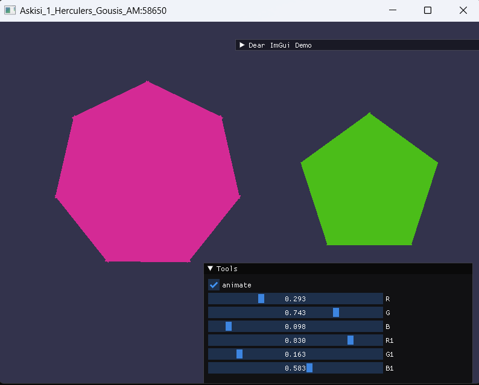
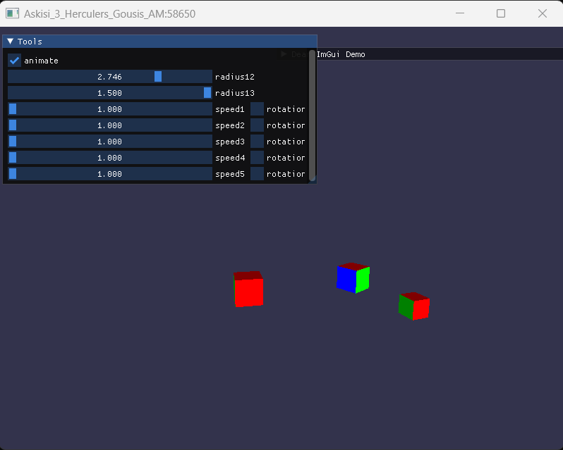
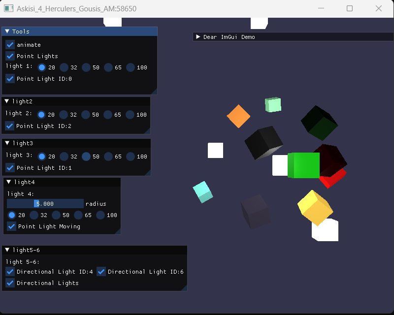

# Εργασία 2 OpenGL

1. Οι εκφωνησείς των ασκήσεων βρίσκονται [Homework files.pdf](https://github.com/HerGousis/Ergasia_2_OpenGL/blob/master/Ergasia_2_OpenGL/Homework%20files.pdf)

2. Παρακάτω παρατίθενται είκονες απο αποτελέσματα των ασκήσεων :

    

    

    

## Notes
Όλες οι ασκήσεις ολοκληρώθηκαν εκτός από την 4η λόγω έλειψης χρόνου. ’πο την άσκηση 4 δεν έγινε με σωστό τρόπο η κινούμενη σημειακή πηγή και η αλληλεπίδραση με το τον δεικτη ποντικιού όταν ειναι πατημένο το Left Ctrl   .